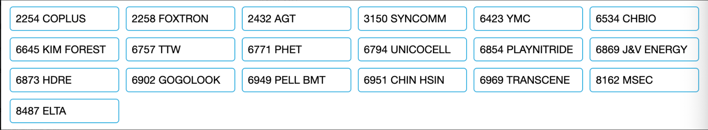

**一、ChatGPT 具有的功能**

1、OCR 识别

关键词`scan`,`ocr`, `return` a list

案例：

>scan the picture and print out the text in lists, for example:2254 COPLUS
>
>

> Chatgpt:
>
> Here is the extracted list of companies from the image:
>
> - 2254 COPLUS
> - 2258 FOXTRON
> - 2432 AGT
> - 3150 SYNCOMM
> - 6423 YMC
> - 6534 CHBIO
> - 6645 KIM FOREST
> - 6757 TTW
> - 6771 PHET
> - 6794 UNICOCELL
> - 6854 PLAYNITRIDE
> - 6869 J&V ENERGY
> - 6873 HDRE
> - 6902 GOGOLOOK
> - 6949 PELL BMT
> - 6951 CHIN HSIN
> - 6969 TRANSCENE
> - 8162 MSEC
> - 8487 ELTA

2、利用智能判断，做一个翻译机器人

翻译机器人 Prompt：

3、用循环功能做一个行业研究机器人

> 应用场景：100 个上市公司需要研究其主营业务，市值，员工等，如果一个个查询，难免效率低。这很适合机器人去做。

4、做一个表格，提供表头和维度

先让 chatgpt 生成 markdown 格式表达，把表达复制到 Typora 之后，再从 Typora 复制，粘贴到 Excel 进行进一步完善。

5、翻译外文书籍

推荐 pdf 英文文档，用谷歌浏览器插件`沉浸翻译`+ 自定义 OpenAI API 来完成。

如果是 epub，也可以用这个完成，翻译效果比 github 上有个大神写的软件还要好一些。

**二、ChatGPT 各个端的区别**

20241029 更新：

在 Web 端现在也自带搜索功能了，这个以前只有 IOS 端和桌面端有。

所以，要不断关注。

**三、用 ChatGPT 写财务分析报告**

> Prompt

我正在编写一份公司的财务分析报告，需对2024年前9个月财务报表数据进行分析并撰写对应文字描述。请根据以下步骤完成报告： 

根据财务数据表格中金额的占比进行排序，从高到低排列项目。 

按照排序结果，套用2024年上半年财务分析模板，

将报告中的时间和数字替换为表格中的最新数据。 确保每个项目的描述和数据保持对齐，不要发生错位。 

请按上述顺序和要求撰写最终的财务分析报告。

以下是模板：

截至2024年6月30日，公司总资产10,504.92万元，其中，流动资产占比86.5%，非流动资产占比13.5%。 截至2024年6月30日，总资产中占比最大的几项资产包括存货、预付账款、应收帐款、货币资金，其中存货（剔除折旧后净值）3828.58万元，占总资产的36.6%；预付账款 2249.72 万元，占总资产的21.5%；应收帐款净额为 1903.13 万元，占总资产的18.2%；货币资金 898.89万元，占总资产的8.6%。 截至2024年6月30日，公司负债合计 10,948.37万元，其中主要为短期借款、应付账款和应付职工薪酬，分别为 7507.60万元、1372.15万元、746.25万元。其中 2024 年上半年新增短期借款3228.18 万元（为银行贷款，以及去年已贷款项产生的利息）。

以下是 2024 年前 9 个月的项目及金额：

| 科目                   | 2024/9/30 | 2024年前九个月占比 |
| ---------------------- | --------- | ------------------ |
| 货币资金               | 2181.23   | 24.1%              |
| 交易性金融资产         |           |                    |
| 应收票据               |           |                    |
| 应收账款净额           | 1512.42   | 16.7%              |
| 预付款项               | 108.56    | 1.2%               |
| 应收利息               |           |                    |
| 其他应收款净额         | 116.27    | 1.3%               |
| 存货净额               | 3523.45   | 39.0%              |
| 其他流动资产           | 370.96    | 4.1%               |
| 流动资产合计           | 7812.89   | 86.5%              |
| 长期股权投资净额       |           |                    |
| 投资性房地产净额       |           |                    |
| 固定资产净额           | 447.38    | 5.0%               |
| 在建工程净额           |           |                    |
| 使用权资产净额         | 333.17    | 3.7%               |
| 无形资产净额           | 400.82    | 4.4%               |
| 商誉                   |           |                    |
| 长期待摊费用           | 7.80      |                    |
| 递延所得税资产         | 30.63     |                    |
| 其他非流动资产         |           |                    |
| 非流动资产合计         | 1219.80   | 13.5%              |
| 资产合计               | 9032.70   |                    |
| 短期借款               | 7406.69   | 58.5%              |
| 应付账款               | 802.67    | 6.3%               |
| 预收款项               |           |                    |
| 合同负债               | 2359.97   | 18.7%              |
| 应付职工薪酬           | 935.57    | 7.4%               |
| 应交税费               | 211.63    | 1.7%               |
| 应付利息               |           |                    |
| 其他应付款             |           |                    |
| 一年内到期的非流动负债 |           |                    |
| 其他流动负债           | 1.42      | 0.0%               |
| 流动负债合计           | 11717.95  | 92.6%              |
| 长期借款               | 500.00    |                    |
| 租赁负债               | 329.04    | 2.6%               |
| 长期应付款             |           |                    |
| 预计负债               |           |                    |
| 递延收益               | 105       |                    |
| 非流动负债合计         | 934.04    | 7.4%               |
| 负债合计               | 12,651.99 |                    |
| 实收资本(或股本)       | 5969.15   |                    |
| 资本公积               | 42236.47  |                    |
| 其他综合收益           | -4.54     |                    |
| 未分配利润             | -51820.38 |                    |
| 少数股东权益           |           |                    |
| 股东权益合计           | -3,619.30 |                    |
| 负债及股东权益合计     | 9,032.70  |                    |

#### 四、如何用好 SearchGPT

通用用法：

as a [role], do something;

Iterative Refinement 很有用，elaborate on sth.

提供参考源：provide sources for further reading.

To maximize your efficiency with OpenAI's SearchGPT, consider the following advanced strategies:

**1. Craft Precise and Detailed Prompts**
   - **Be Specific**: Clearly articulate your query to guide SearchGPT effectively.
     - *Example*: Instead of "Explain machine learning," use "Provide an overview of supervised learning techniques in machine learning."
   - **Set Context**: Define the role or perspective you want SearchGPT to assume.
     - *Example*: "As a financial analyst, summarize the latest trends in renewable energy investments."

**2. Utilize Advanced Prompt Engineering Techniques**
   - **Role Assignment**: Instruct SearchGPT to act as a specific expert.
     - *Example*: "Act as a cybersecurity expert and explain the implications of the latest data breach."
   - **Step-by-Step Guidance**: Request detailed, sequential explanations for complex topics.
     - *Example*: "Break down the process of setting up a virtual private network (VPN) step by step."
   - **Iterative Refinement**: Engage in follow-up questions to delve deeper into subjects.
     - *Example*: After receiving an initial response, ask, "Can you elaborate on the security protocols involved in VPNs?"

**3. Leverage SearchGPT's Web Browsing Capabilities**
   - **Access Real-Time Information**: Use SearchGPT to retrieve up-to-date data, such as current events or market trends.
     - *Example*: "Provide the latest stock prices for major tech companies."
   - **Verify Sources**: Request citations or source links to ensure the credibility of the information provided.
     - *Example*: "Summarize recent advancements in AI research and provide sources for further reading."

**4. Employ Data Analysis Features**
   - **Upload and Analyze Data**: Utilize SearchGPT's capability to process and interpret datasets.
     - *Example*: "Analyze the attached sales data and identify quarterly trends."
   - **Generate Visualizations**: Request charts or graphs to visualize data insights.
     - *Example*: "Create a bar chart comparing monthly revenue for the past year."

**5. Engage with Voice Mode for Natural Interactions**
   - **Activate Voice Conversations**: Use the voice mode to have spoken dialogues with SearchGPT, enhancing the conversational experience.
     - *Example*: "Explain the concept of blockchain technology in simple terms."
   - **Real-Time Language Translation**: Leverage voice mode for immediate translation between languages.
     - *Example*: "Translate the following English sentence into Spanish: 'What are the benefits of renewable energy?'"

**6. Maintain Security and Privacy**
   - **Avoid Sharing Sensitive Information**: Refrain from inputting personal or confidential data to protect your privacy.
   - **Verify Information**: Cross-check critical information from multiple sources to ensure accuracy.

By implementing these strategies, you can effectively harness the full potential of OpenAI's SearchGPT for a wide range of applications. 

