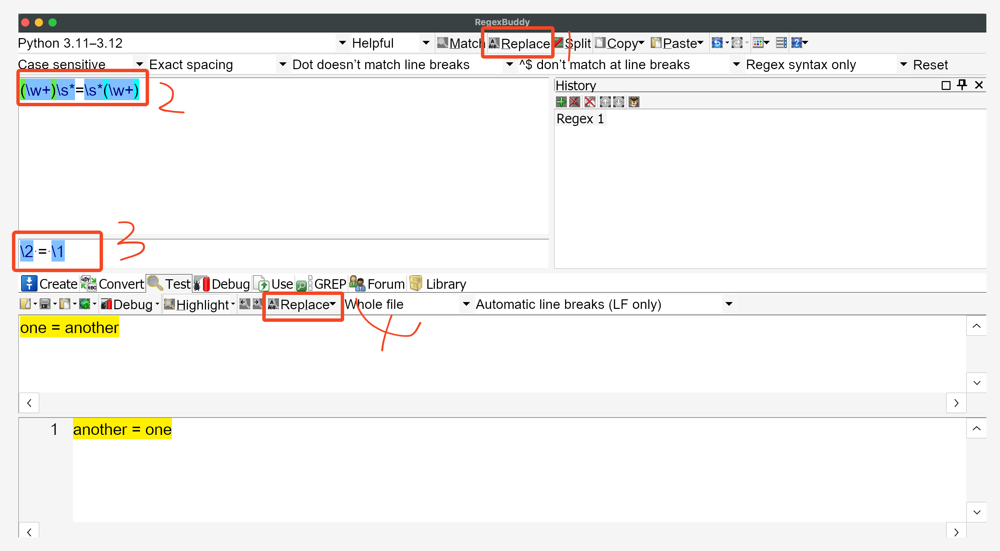
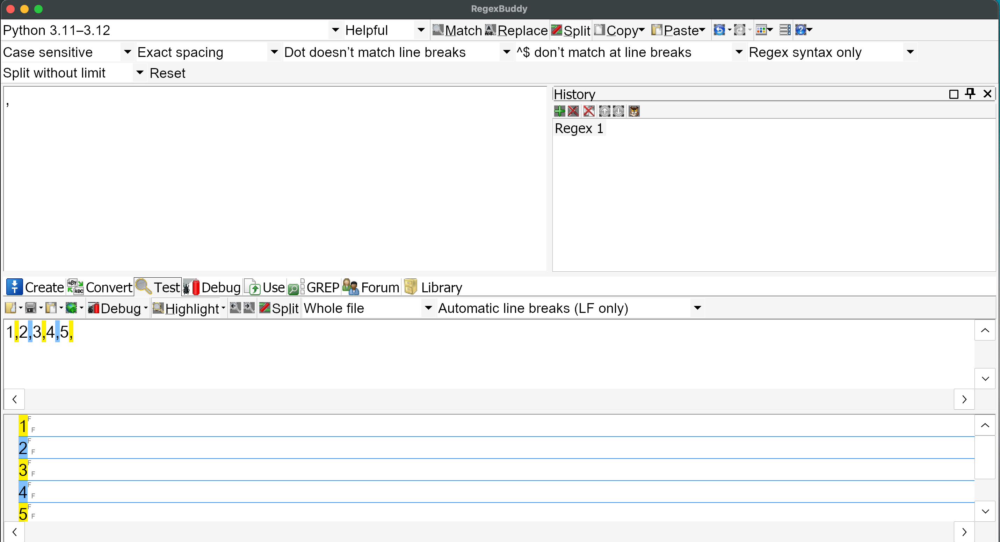

## 总结：各种编程语言的异同

|                             | 含义                                                      | 相同点 | 不同点(python/Java/ JS/Ruby/Perl/.net)                  |
| --------------------------- | --------------------------------------------------------- | ------ | ------------------------------------------------------------ |
|                             |                                                           |        |                                                              |
| **Metacharacter**           |                                                           |        |                                                              |
| `.`                         | any single character                                      |        |                                                              |
| `a|b`                       | a or b                                                    |        |                                                              |
| `\s`                        | space(`\r\n\t\`)                                          |        |                                                              |
| `\S`                        | any non-whitespace character                              |        |                                                              |
| `\d`                        | any single number([0-9])                                  |        |                                                              |
| `\D`                        | negation of \d                                            |        |                                                              |
| `\w`                        | alphanumeric                                              |        |                                                              |
| `\W`                        | negation of \w                                            |        |                                                              |
| `\X`                        | Any unicode sequences, linebreaks included                |        |                                                              |
| `\R`                        | unicode newlines                                          |        |                                                              |
| `\N`                        | new line                                                  |        |                                                              |
| `\v`                        | vertical whitespace character                             |        |                                                              |
| `\V`                        | negation of \v                                            |        |                                                              |
| `\h`                        | horizontal whitespace character                           |        |                                                              |
| `\H`                        | negation of \h                                            |        |                                                              |
| **Anchors**                 |                                                           |        |                                                              |
| `^`                         | start of string（每一行字符开头都匹配）                   |        |                                                              |
| `$`                         | end of string (每一行末尾都匹配)                          |        |                                                              |
| `\A`                        | start of string（只匹配这大段文字开头）                   |        |                                                              |
| `\Z`                        | end of string（只匹配大段文字结尾）                       |        |                                                              |
| `\z`                        | absolute end of string                                    |        |                                                              |
| `\b`                        | a word boundary （alphanumeric 两边，ie.`[a-zA-Z0-9_]`）  |        |                                                              |
| `\B`                        | Non-word boundary                                         |        |                                                              |
|                             |                                                           |        |                                                              |
| **Quantifiers**             |                                                           |        |                                                              |
| `*`                         | equal to`{0,}` lazy mode: `*?`                       |        |                                                              |
| `+`                         | equal to`{1,}` laze mode: `+?`                       |        |                                                              |
| `?`                         | equal to `{0,1}`                                          |        |                                                              |
| `{m}`                       | exactly m times                                           |        |                                                              |
| `{m,n}`                     | bet m and n                                               |        |                                                              |
| `{m,}`                      | at least m times                                          |        |                                                              |
| `{,n}`                      | at most n times                                           |        |                                                              |
| **Character Classes**       |                                                           |        |                                                              |
| `[abc]`                     |                                                           |        |                                                              |
| `[^abc]`                    | not a or b or c                                           |        |                                                              |
| `[a-z]`                     | a character in the range:a-z                              |        |                                                              |
| `[^a-z]`                    | a character not in the range:a-z                          |        |                                                              |
|                             |                                                           |        |                                                              |
|                             |                                                           |        |                                                              |
| **Group Constructs**        |                                                           |        |                                                              |
| capture everything enclosed | `(...)`                                                   |        |                                                              |
| atomic group(non-capturing) | `(?>...)`                                                 |        |                                                              |
| comment group               | `(?#...)`                                                 |        |                                                              |
| named capturing group       | `(?<name>...)`                                            |        |                                                              |
| positive lookahead          | `(?=...)`                                                 |        |                                                              |
| negative lookahead          | `(?!...)`                                                 |        |                                                              |
| positive lookbehind         | `(?<=...)`                                                |        |                                                              |
| negative lookbehind         | `(?<!...)`                                                |        |                                                              |
| **Flags/Modifiers**         |                                                           |        |                                                              |
| `g`                         | Global                                                    |        |                                                              |
| `m`                         | Multiline                                                 |        |                                                              |
| `i`                         | Case insensitive                                          |        |                                                              |
| `x`                         | Ignore whitespace/verbose                                 |        |                                                              |
| `s`                         | Single line                                               |        |                                                              |
| `u`                         | Unicode                                                   |        |                                                              |
| `U`                         | ungreedy                                                  |        |                                                              |
| `n`                         | Non-capturing groups                                      |        |                                                              |
| **Substitution**            |                                                           |        |                                                              |
| `$1`                        | Contents in capture Group1                                |        | Python/ JS use `\1` Perl use `$` .Net us `match.Groups(1)` |
| `$0`                        | Complete match contents                                   |        |                                                              |
| `${foo}`                    | Contents in capture group foo                             |        |                                                              |
| `\t`                        | Insert a tab                                              |        |                                                              |
| `\r`                        | Insert a carriage return                                  |        |                                                              |
| `\n`                        | insert a new line                                         |        |                                                              |
| `\f`                        | insert a form feed                                        |        |                                                              |
| `\U`                        | uppercase transformation，通常搭配`\E`以标注 转换截止位置 |        | Python 不支持转换                                            |
| `\L`                        | lowercase transformation                                  |        | Python 不支持转换                                            |
| `\E`                        | terminate \L or \U conversion                             |        | Python 不支持转换                                            |
|                             |                                                           |        |                                                              |
|                             |                                                           |        |                                                              |

来源：https://regex101.com/

### Insert token

任何时候，如果不记得对应的 字符是什么时候，在pattern 编辑界面（红框里）右键，就能显示

`Insert token`

##  Find and replace

按照图中操作，依次点击。

当然任何时候对regex pattern 不理解，可以点击 create 按钮，其中有详细的解释。

### Split

这个有点像Excel 中分列，或者 Python 中，通过特定的字符（空格或者逗号等）作为分隔符号

注意，pattern 中输入的是分隔符，而下方 test 框中输入待分隔的字符串——1,2,3,4,5。

