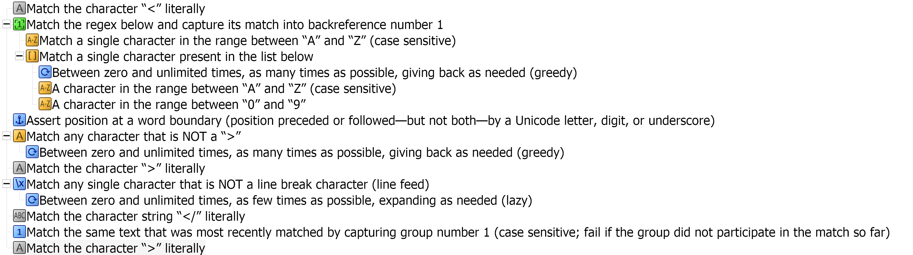

# 正则表达式CheatSheet


## 灵感来源

1、regex library:https://www.regexlib.com/DisplayPatterns.aspx

2、the Regular expression cookbook，我这个 cheatsheet 大纲就是参考 cookbook 目录写的

3、Regular Expressions info:https://www.regular-expressions.info/examples.html

4、BBEdit 15.2 Manual


## Validating and formatting

### Email 提取

情景描述：

Check email 地址是否符合注册规范。

解决方案：

```python
r"\b[A-Z0-9._%+-]+@[A-Z0-9.-]+\.[A-Z]{2,}\b"
```


### password complexity


ID card


### Phone numbers


### ip address


### Credit card Numbers

CS50x Week 1 有个 C 语言的问题挺有趣，可以用Regex 解决

https://cs50.harvard.edu/x/2024/psets/1/credit/


## Words, lines and special Characters

文档去掉多行

问题：典型的要去掉空行的字符串是这样的，通常 word 中也很难处理


查询多行的pattern:

`^\s*\n\s*\n`

如果有三行，再添加一个`\s*\n`


### 指定英文单词简写或者全称

情景描述：

把正则表达式的各种表达都检索出来，包括：

regular expression

regular expressions

regex

regexp

Regexes

解决方案：

```
r"reg(ular expressions?|ex(p|es)?)"
```


**还有对于忘记单词拼写，这个也很有用**

Seperate separate 或者 seperete，有时候不知是哪个单词，可以一键替换。用下列公式可以全部提取出来

```sep[ae]r[ae]te```


**如果单词中大小写不统一，也可以用上。**

`[Ss]mith`， 这样的 pattern, smith 和 blachsmith 都满足要求。

`[Cc]heng\s?[Yy]ong` ，中间\s? 意思是不管中间有没有空格都匹配。


### 匹配一个元音或者辅音

```python
# in python using regex module rather than re module
import regex

# https://stackoverflow.com/questions/28783146/intersection-of-two-regex-classes
# 根据上面stackoverflow的回答，终于知道Regex module中用法了

# intersection
s = regex.findall("[[a-z]&&[^aeiou]]","I have a dream",regex.VERSION1) # to find consonant in the string
print(s)

# subtraction or difference
s1 = regex.findall("[[a-z]--[aeiou]]","I have a dream",regex.VERSION1) # to find consonant in the string
print(s1)

# symmetric difference
s2 = regex.findall("[[a-e]~~[c-f]]","I have a dream of going to U.S.",regex.VERSION1) #to find a b and f in the string
print(s2)

# Union
s3 = regex.findall("[[ae]||[iou]]","I have a dream of going to U.S.",regex.VERSION1) #to find vowel in the string
print(s3)

```

或者采用 Regex Solver

```
# intersection using Regex Solver
# refer to https://docs.regexsolver.com/overview.html
from regexsolver import RegexSolver, Term

term1 = Term.regex(r"[a-z]")
term2 = Term.regex(r"[aeiou]")

# gen all consonants using subtraction
result1 = term1.subtraction(term2)
result2 = term1.intersection(term2)
result3 = term1.union(term2)
result4 = term1.is_subset_of(term2)
print(result1)
print(result2)
print(result3)
print(result4)
```

Result:

```markdown
regex=[b-df-hj-np-tv-z]
regex=[aeiou]
regex=[a-z]
False
```

### 元音+元音 带来加音的情况

```
\b\w*[aeiou]\s[aeiou]\w*\b
```


### 寻找 L 结尾，下一句开头是元音的词组：

灵感来自李笑来：

这些年攒了几百本有声书，有了 whisper，就给它们都做了一遍 srt，然后就成了“语音语料库”——需要找什么例子的时候，跑个脚本就能找到语音例句。比如，想要找“音结尾的单词于其后元音开头的单词连读，就搜索
```\b\w*(I|le)\b\s[aoiue]\w*```


延伸：

同样的，关于stop sound, 元音+元音造成的加音，辅音+元音，辅音+辅音（首尾相同）等都可以用正则表达式表示。


stop sound + 辅音开头，是要stop的；stop sound+元音开头，是要连读的。 stop sound 句尾无非是 t d k b p f 这些，下一句辅音开头最好negate，因为辅音太多了。 大概就是

```\b\w*[tdkbpf]\b\s[^aeiou]\w*\b```

这个还没有实战中尝试，当然可能会miss一些例子 不过够用了。


### 将first name和last name倒过来

知识点：用capturing group


### Microsoft Word中 用通配符来替换

> 20241017 更新
>
> 背景：用 ChatGPT 的 GPT 来生成 Company Analyzer 的时候，不必要的会产生一些多余的文章来源，粘贴到 Word 中，需要进行格式化，去除一些多余的部分（网页链接、数据来源等）。

`【([0-9])】` 可以用来替换 Word 文档中，多余的“【6】”等这样的序号段。


`【([0-9]{1,})†[A-z]{1,}】`可以查找到类似于这样的字段：“【49†source】”


Microsoft  Excel 中，可以用 `~*`来匹配 `*`这个特殊字符（一定要注意在英文键盘下输入`~`），因为在 Excel 中，`*`用于匹配任何字符。


## Numbers

### 文件名中提取日期

情景描述：【已签署留档】20210910 沪兆芯股2021（6）号-投资北京、西安、香港+增资资产评估.pdf，在这个文件名中，只提取 20210910，而去掉 2021（6）

解决方案：

```
r"\b\d{6,}\b" #即使左右两边有字符或者其他汉字、中文符号等，也可以成功提取数字
```

但是之前尝试`^\d{6,}$`失败了，经过测试，它只适合前后都没有字符的情况。


现在 WPS Excel 也支持正则表达式，提取日期函数如下：


### 十六进制数字

`[A-Fa-f0-9]` 或者[\da-fA-F]


### 隐去身份证号、电话号码若干位

917-567-1234
646-768-2548
212-222-5851
0712-130-4576


> \d{3,4}[.-]\d{3}[.-]\d{4} 只能匹配前两个电话
> \(?\d{3,4}[-.)]\d{3}[-.]?\d{4} 能匹配所有的号码

在第二个 pattern 基础上，我想要捕获第一组 917 646 或者 212 或者 0712，后面 7 位数字变成 -xxx-xxxx
可以用 captured group

```
Search: \(?(\d{3,4})[-.)]\d{3}[-.]?\d{4}
repalce: \1-xxx-xxxx
```
成功将如上的电话号码变为只显示区号的隐藏号码。
917-xxx-xxxx
646-xxx-xxxx
212-xxx-xxxx
0712-xxx-xxxx

教程见 《BBEdit 15.1.2 Manual》 P212 


注：Typora 本身也支持正则表达式 numbered group

用`$1-$2-****`命令可以替换成功，用`/1`显示不成功。


### 匹配数字练习


题目：

>
>
>| Task  | Text       |
>| ----- | ---------- |
>| match | 3.14529    |
>| match | -255.34    |
>| match | 128        |
>| match | 1.9e10     |
>| match | 123,340.00 |
>| skip  | 720p       |


```
-?\d*,?\d*\.?\d*e?\d* # 没有过关

# 答案是
^-?\d+(,\d+)*(\.\d+(e\d+)?)?$
```

> 差异 1：(,\d+)，答案是括起来的，也就是有,就有后面至少 1 个数字。
>
> 差异 2：同理，有 e 就有\d+，这个括起来加上?，也就是有或者无
>
> 差异 3：小数点，有\.就有后面的\d，这个括起来加上?，也就是有或者无。此后没有其他的符号了。
>
> 说明我还是太年轻，需要多练习，见世面。


### look around 提取数字

这里利用 negative lookbehind

注意四种表达方式是这样的：

positive lookahead 

negative lookahead

positive lookbehind

nagative lookbehind


> pattern: `\b(?<!\$)\d+\b`

下面的 pattern 含义，是只排除类似于`$xx` 这样的组合，`xx$`是满足 regex 要求的。


## Souce code 

### 批量提取Python 程序中comment

知识点：用 multi-line mode，结合^和$

```python
r"(?m)^#\s*.*?$"
```

String：

```
# a code that implements the same function as hello_jack.c
name = input("What's your name?")

# 默认在字符串间加上空格
print("hello,", name) 
print("hello,",name, sep="?")

#和上面输出形式等效
print(f"hello, {name}") 
print("hello, "+ name) 
```

Matched Result：

> #a code that implements the same function as hello_jack.c
> #默认在字符串间加上空格
> #和上面输出形式等效


## URL, Paths and Internet Addresses

### 匹配 IP 地址

——更新于 2024.9.4 深夜

知识点：

- 用到 subpattern，用括号括起来，结合 repetitor 一起使用。

- 还有就是 OR 的几个表达式先后顺序很重要

如果是计算机生成的 IP 地址，可以用如下 pattern 匹配:

```
(\d{1,3}\.){3}\d{1,3}
```


> 192.168.1.200

但如果是用户输入的数字，我们要 validate 其有效性，有可能出现 `192.300.268.500 `这样的数字，但是实际上每一个数字不可能超过 255，因此上面的 pattern 要进一步优化。

分析：0-255，有三种情况，用 OR 匹配起来

0-99，100-199：百位是0或 1，十位和个位都是 0-9

200-249：百位是 2，十位数是 1-4，个位数是 0-9

250-255：百位是 2，十位数是 5，个位数是0-5


```python
# 匹配 0-255 的数字，注意为了避免只匹配 330 前面的 33，这里在第一个里面左右加入了
# \b，也就是说 330，不符合`\b[0,1]?[0-9]?[0-9]\b`的 pattern，\b 不匹配数字 0
(\b[0,1]?[0-9]?[0-9]\b)|(2[0-4][0-9])|(25[0-5]) 

# complete pattern
# 注意这里的括号层级，有三层括号，第二层括号，是为了把 上面三种情况用 OR 搭配起来，然后加上\.，第三个括号是把前面的三种情况，加上\. 这个字符串整体，复制 3 份。
((([0,1]?[0-9]?[0-9])|(2[0-4][0-9])|(25[0-5]))\.){3}(([0,1]?[0-9]?[0-9])|(2[0-4][0-9])|(25[0-5]))
```

> **Trouble Shooting：**

这里有个 bug，就是 255.255.255.255，只能匹配 255.255.255.25，最后一个 5 消失了。


答案在于 OR 的三种情况的先后顺序很重要，由于`([0,1]?[0-9]?[0-9])`这个公式排在第一位，那么 匹配255 时，前面两个字符25 已经能够满足匹配了，后面的两种情况 regex engine 自动忽略了。所以要把第一种情况放在OR最后。


```
# 改进后的匹配
((2[0-4][0-9])|(25[0-5])|([0,1]?[0-9]?[0-9]))

# 改进后的 pattern，可能是我写过最复杂的 regex pattern 了
(((2[0-4][0-9])|(25[0-5])|([0,1]?[0-9]?[0-9]))\.){3}((2[0-4][0-9])|(25[0-5])|([0,1]?[0-9]?[0-9]))
```

搞定了：


### Email address

Text to match:

> Hello, ben@forta.com is my email address.

Regex Pattern：

> hint use capture groups and nested capture groups

`\w`

replace:


## Markup and Data formats

markdown, html,xml, CSV, JSON


### 用 backreferences 匹配 html 中H1、H2 等等

`r"<H[1-6]>"`

用backreferences：

```python
r"<([A-Z][A-Z0-9]*)\b[^>]*>.*?</\1>"
```

()表示一个 numbered captured group，

`[A-Z][A-Z0-9]*`匹配一个类似乎 H1 的 html tag，

`\b`匹配词语的 boundary，

`[^>]*`表示中间若干个 string，不存在`>`，避免出现 匹配了`<EM> this is a test </EM>`这样一整段的现象。

`>`literal text

`.*?` 表示 lazy *，尽量少的匹配字符。

`</\1>`其中 `</ >` 是 literal ，`\1`是 reference。




### 批量转换图片 markdown 格式到html 格式

search:

```
!\[([\w-]*)\]\(([-\w\./]*)\)(?#batch converting picture markdown format to html format)
```

replace:

```

```


## File I/O

### MAC 上搜索特定文件

在 Mac Finder 上寻找特定文件：

https://support.apple.com/en-am/guide/mac-help/mh15155/mac

方法 1：用 `AND` `OR` 和 `NOT`

方法 2：通过添加条件 1（name contain `兆芯`）、条件 2（譬如 file extension 选 `docx`）、田间 3（name contains `议事规则`）


### 批量重命名文件

Mac OS 上有一个很好的软件`NameChanger`，支持 prepend、append、Regular Expression、Insert a sequence等多种模式

prepend：在之前的文件名`之前`基础上统一加上指定文字，这个在我归档时候特别有用；

append：在当前的文件名`末尾`添加指定文字。


还有个更厉害的，就是利用 Regular expression 中的 backreferences，改变文件名中字符串的顺序，譬如原来是`兆芯 2024 年股东会-20240325`，我想重命名为`20240325-兆芯 2024 年股东会`。

核心问题是匹配所有中文字符，现在 RegexBuddy 上测试 pattern


这里测试成功了，具体来说：

match pattern：`([一-龟0-9]+)-(\d+)`

这里是利用 backreferences，将`-`两边的文件名分别索引为`$1`、`$2`，然后 replace 部分，倒过来就可以了。

> 注：具体中间的 literal text 是空格还是短横杠取决于具体场景，两种都有，就用`-?\s?` 匹配。


然后，在 NameChanger 中测试，通过了。


> 以下是 rename app 中的帮助页：

Regular expressions provide great power and flexibility when it comes to matching strings.

For each file in the table, NameChanger will find the first block of text that matches the given regular expression in the *Original Text* field and replace it with the text from the *New Text* field. If the regular expression does not match a particular file, that file will not be renamed.
The [*Force Unique*](../General/Options.html) option can be used to prevent name collisions from the resulting name changes.
To avoid changing file extensions, the [*Hide Extensions*](../General/Options.html) option can be used.


For back references use $1, $2, etc, to match the corresponding parenthesized grouping from the matching text. This is an excellent way to rearrange existing filenames.


> 注意：重命名doc pdf md 等文档的时候，最好把后缀名隐藏掉，在 Menu 中去找：


### 模版

情景描述：


解决方案：
