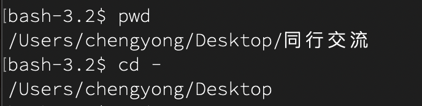

# 一、帮助键等

### 1、帮助键

`man ls` 

如果要查看社区关于这个命令的用例，用`tldr ls`


> 如何更好的使用 tldr

**Basic Usage**:
`tldr <command>`

This will show a summary with the most common usage examples for the specified command, such as `tldr tar`.

**Search for Specific Options or Actions**: You can use `tldr`'s search functionality if available in your installation:
`tldr <command> | grep <keyword>`

This is useful if you’re looking for a specific example, like:
`tldr find | grep "delete"`

**Update the Cache**: To make sure you have the latest examples, update your `tldr` cache regularly:
`tldr -u` 或者 `tldr --update`

**Use Aliases for Faster Access**: You can create a shell alias to make calling `tldr` even faster. For example:
`alias t="tldr"`
Now you can just type `t <command>` for the same result.

**List All Commands**: If you want to browse all available commands supported by `tldr`, use:
`tldr --list`


### 2、访问常用的命令 `autojump`

  - 1. **Basic Usage**:
    
    ```
    j <directory_name>
    ```
    
    Instead of typing the full path, just use `j` followed by a keyword related to the directory. `autojump` will take you there if it’s a frequently visited path.
    
    For example:
    
    ```
    j projects
    ```
    
    This will take you to a directory with "projects" in its path if you've navigated to it often before.
    
    2. **Check Directory Rankings**:
    
    To see a list of all directories tracked by `autojump` and their rankings, use:
    
    ```
    autojump -s
    ```
    
    This shows you the directories `autojump` has learned, along with their "weight" based on how often you visit them.
    
    3. **Navigate Using Partial Matches**:
    
    You don’t have to type the full directory name or even the start of it. For example:
    
    ```
    j proj
    ```
    
    `autojump` will match any directory containing "proj" if it’s a frequently accessed one.
    
    譬如我之前 `cd "/Users/chengyong/Documents/01_Coding/01_CS 自学笔记"`
    
    当我去了别的文件夹之后，直接输入`j Coding` 就来到了”/Users/chengyong/Documents/01_Coding/01_CS 自学笔记“这个文件夹。
    
    4. **Add Specific Paths**:
    
    You can manually add a directory to `autojump`'s database using:
    
    ```
    autojump <path>
    ```
    
    This can be useful if you have directories you want quick access to without needing to visit them repeatedly.
    
    5. **Forget a Directory**:
    
    To remove a directory from `autojump`’s database:
    
    ```
    autojump --forget <directory_name>
    ```
    
    Use this if a directory no longer exists or if you don’t want it in your quick access list.
    
    6. **Use with Tab Completion**:
    
    Most installations of `autojump` support tab completion, which can help you see available directories as you type. Ensure it’s set up in your shell by adding `autojump` to your shell configuration file (`.bashrc`, `.zshrc`, etc.) if it isn’t already.
    
    7. **Set Up Aliases**:
    
    For even faster usage, you can create an alias. Many users alias `j` to `autojump` by default, but you could also alias it differently or use it with other commands:
    
    ```
    alias cdj='cd "$(autojump <keyword>)"'
    ```
    
    This will `cd` into the directory directly.
    
    8. **Jump Backwards**:
    
    If you want to jump back to the previous directory, you can use `j -`:
    
    ```
    j -
    ```
    
    By practicing with `autojump`, you can save time navigating the filesystem, especially in environments where you often switch between deep or complex directory structures.


### 3、浏览历史命令

**任何时候在 terminal 中敲快捷键 control+ R，输入关键字就能调取过往敲过的含有关键字的命令，使用 Tab 键选择相关命令。这是 Fzf 的一个快捷键**

### history

`history` 

查看所有的历史命令：`history 1`

在历史命令中，查看带有`hexo`的命令：`history | grep "hexo"`


### fzf

**File Search**: `fzf`

**Command History Search**: `history | fzf` or **Ctrl+R**

**Git Branch Switch**: `git branch | fzf | xargs git checkout`

**Navigate to Directory**: `cd "$(find . -type d | fzf)"`

**Preview Files**: `fzf --preview 'cat {}'`

**Search Recent Files**: `find . -type f -mtime -7 | fzf`

**Custom Key Bindings**: `export FZF_DEFAULT_OPTS='--layout=reverse --height 40%'`


### **查看前面几个命令：**

可以用 `Ctrl + R`，可以取代`!$`

 `Option + . ` 功能等同于`!! `


# 二、Shell 命令

Here's a comprehensive list of useful bash commands organized by categories, along with brief descriptions for each command:

###  1. File Management
| Command | Description                                                  |
| ------- | ------------------------------------------------------------ |
| `ls`    | List files and directories. Use `-l` for detailed listing, `-a` to include hidden files. |
| `cd`    | Change directory.                                            |
| `pwd`   | Print working directory (shows current directory path).      |
| `mkdir` | Create a new directory.                                      |
| `rmdir` | Remove an empty directory.                                   |
| `cp`    | Copy files or directories. Use `-r` for recursive copying.   |
| `mv`    | Move or rename files and directories.                        |
| `rm`    | Remove files or directories. Use `-r` to remove directories. |
| `touch` | Create an empty file or update the timestamp of an existing file. |
| `cat`   | Concatenate and display file contents.                       |
| `less`  | View file content one screen at a time.                      |
| `find`  | Search for files and directories.                            |

### ls 用法

#### `ls -l` 

detailed listing, this is the character L

`ls /Users/chengyong/Desktop`

will list all the files in the specified dir. 


```
missing:~$ ls -l /home
drwxr-xr-x 1 missing  users  4096 Jun 15  2019 missing
```

其中 d 代表 这是个文件夹，rwxr 代表 missing 这个文件夹的 owner 的权限，users 的权限是 xr。

w 代表 write 权限， x 代表 search 权限，r 代表阅读具体文件内容的权限。


#### `ls *.md` 

list all files with md suffix

#### `ls project?` 

use ? to reprensent any number or character

#### `ls SICP*` 

use * to represent any lengths of character

譬如`SICP-封面.docx`也能找出来。

#### `ls -1` 

list one file per line

#### `ls -d */` 

list 当前文件夹下的文件夹，不包含文件。

#### `ls -t`

sort files by modification time, newest first.

`ls -tr`, will order reversely, oldest first

#### `ls -S`

sort files by the size, largest first.

#### `ls -Sr`

reverse the order


### cd 用法

`cd -`: 打开上一个打开过的文件夹



### mv 用法

 - Rename a file or directory when the target is not an existing directory:
    `mv path/to/source path/to/target`

  - Move a file or directory into an existing directory:
    `mv path/to/source path/to/existing_directory`

  - Move multiple files into an existing directory, keeping the filenames unchanged:
    `mv path/to/source1 path/to/source2 ... path/to/existing_directory`


### 2. **Text Processing**

| Command | Description                                                  |
| ------- | ------------------------------------------------------------ |
| `grep`  | Search text using patterns.                                  |
| `sed`   | Stream editor for finding and replacing text.                |
| `awk`   | Pattern scanning and processing language.                    |
| `cut`   | Cut sections from each line of files.                        |
| `sort`  | Sort lines of text.                                          |
| `uniq`  | Report or filter out repeated lines.                         |
| `tr`    | Translate or delete characters.                              |
| `wc`    | Count words, lines, and characters.                          |
| `head`  | Output the first part of files.                              |
| `tail`  | Output the last part of files. Use `-f` to follow new data as it is appended. |

### 3. **File Permissions & Ownership**
| Command | Description                       |
| ------- | --------------------------------- |
| `chmod` | Change file permissions.          |
| `chown` | Change file ownership.            |
| `chgrp` | Change group ownership of a file. |

### 4. **System Monitoring & Information**
| Command  | Description                                           |
| -------- | ----------------------------------------------------- |
| `top`    | Display system tasks and resource usage in real-time. |
| `htop`   | Interactive process viewer (if installed).            |
| `ps`     | Display running processes.                            |
| `df`     | Report file system disk space usage.                  |
| `du`     | Estimate file space usage.                            |
| `free`   | Display memory usage.                                 |
| `uptime` | Show how long the system has been running.            |
| `uname`  | Print system information.                             |
| `lscpu`  | Display information about the CPU architecture.       |
| `lsblk`  | List information about block devices.                 |

### 5. **Networking**
| Command      | Description                                         |
| ------------ | --------------------------------------------------- |
| `ping`       | Send ICMP echo requests to network hosts.           |
| `ifconfig`   | Display network configuration.                      |
| `ip`         | Show/manipulate routing, devices, and tunnels.      |
| `curl`       | Transfer data to or from a server.                  |
| `wget`       | Download files from the internet.                   |
| `netstat`    | Show network connections, routing tables, and more. |
| `traceroute` | Show the path packets take to a network host.       |
| `ssh`        | Securely connect to remote servers.                 |

### 6. **System Management**
| Command     | Description                                     |
| ----------- | ----------------------------------------------- |
| `shutdown`  | Shut down or restart the system.                |
| `reboot`    | Reboot the system.                              |
| `sudo`      | Execute commands with superuser privileges.     |
| `systemctl` | Control system services (start, stop, restart). |
| `service`   | Manage system services.                         |
| `crontab`   | Schedule commands to run at specific times.     |

### 7. **File Compression & Archiving**
| Command  | Description                                                  |
| -------- | ------------------------------------------------------------ |
| `tar`    | Archive multiple files into a single file, and extract them. |
| `gzip`   | Compress files using gzip.                                   |
| `gunzip` | Decompress files compressed by gzip.                         |
| `zip`    | Compress files into a .zip archive.                          |
| `unzip`  | Extract files from a .zip archive.                           |

### 8. **Disk Usage & Management**
| Command  | Description                               |
| -------- | ----------------------------------------- |
| `mount`  | Mount a file system.                      |
| `umount` | Unmount a file system.                    |
| `fdisk`  | Partition table manipulator for Linux.    |
| `mkfs`   | Build a Linux file system.                |
| `fsck`   | File system consistency check and repair. |

### 9. **User & Group Management**
| Command    | Description                    |
| ---------- | ------------------------------ |
| `adduser`  | Add a new user.                |
| `userdel`  | Delete a user.                 |
| `usermod`  | Modify user information.       |
| `passwd`   | Change a user's password.      |
| `groupadd` | Add a new group.               |
| `groups`   | Show groups a user belongs to. |

### 10. **Package Management (for Debian-based Systems)**
| Command           | Description                                           |
| ----------------- | ----------------------------------------------------- |
| `apt-get update`  | Update the package index.                             |
| `apt-get upgrade` | Upgrade all installed packages to the latest version. |
| `apt-get install` | Install a package.                                    |
| `apt-get remove`  | Remove a package.                                     |
| `dpkg`            | Low-level package manager for Debian-based systems.   |

## 11. **Bash Scripting**
| Command                 | Description                                                  |
| ----------------------- | ------------------------------------------------------------ |
| `echo`                  | Print text to the terminal.                                  |
| `read`                  | Read a line of input from the user.                          |
| `for`, `while`, `until` | Loop structures for repeating commands.                      |
| `if`, `elif`, `else`    | Conditional statements.                                      |
| `function`              | Define a function in a script.                               |
| `exit`                  | Exit a script or shell.                                      |
| `&&`, `||`              | Execute commands conditionally based on success/failure of previous command. |

These categories cover a wide range of essential tasks that you might need to perform on a Unix-like system. Each command has options that allow more specific actions, and checking their man pages (e.g., `man ls`) will provide detailed information on how to use them effectively.


12. ## Special shell variables

    

| Variable                     | Description                                                  |
| :--------------------------- | :----------------------------------------------------------- |
| **Process information**      |                                                              |
| `$$`                         | Process ID of shell                                          |
| `$PPID`                      | Process ID of shell’s parent process.**Quirk Warning:**For subshells, the value of PPID is inherited from the parent shell. Thus, PPID is only the parent of the outermost shell process. |
| `$?`                         | Exit status of last command.                                 |
| `$_`                         | Name of last command. if the last command is `echo hello > hello.txt`  then `echo $_` is equal to `echo hello` |
| `$!`                         | Process ID of last process run in the background using ampersand (&) operator. This is commonly used in conjunction with the `wait` builtin. |
| `!!`                         | if the last command is `cd /usr/`, but you have no perssions, you can type `sudo !!` it means `sudo cd /usr/`, but will save you the time to type all of the characters. |
| `$PATH`                      | A colon-delimited list of locations where trusted executables are installed. Any executable in one of these locations can be executed without specifying a complete path. |
| **Field and record parsing** |                                                              |
| `$IFS`                       | Input Field Separators (uses are explained in [Variable Expansion and Field Separators](https://developer.apple.com/library/archive/documentation/OpenSource/Conceptual/ShellScripting/FlowControl,Expansion,andParsing/FlowControl,Expansion,andParsing.html#//apple_ref/doc/uid/TP40004268-CH4-SW22)) |
| **User information**         |                                                              |
| `$HOME`                      | The user’s home directory.                                   |
| `$UID`                       | The user’s ID.**Security Warning:**This value can be modified by the calling script, so it should not be used for authentication purposes. |
| `$USER`                      | The user’s (short) login name.**Security Warning:**This value can be modified by the calling script, so it should not be used for authentication purposes. |
| **Miscellaneous Variables**  |                                                              |
| `$#`                         | Number of arguments passed to the shell. This variable is described further in [Handling Flags and Arguments](https://developer.apple.com/library/archive/documentation/OpenSource/Conceptual/ShellScripting/ResultCodes,Chaining,andArgumentParsing/ResultCodes,Chaining,andArgumentParsing.html#//apple_ref/doc/uid/TP40004268-CH5-SW63). |
| `$@`                         | Complete list of arguments passed to the shell, separated by spaces.. This variable is described further in [Handling Flags and Arguments](https://developer.apple.com/library/archive/documentation/OpenSource/Conceptual/ShellScripting/ResultCodes,Chaining,andArgumentParsing/ResultCodes,Chaining,andArgumentParsing.html#//apple_ref/doc/uid/TP40004268-CH5-SW63). |
| `$*`                         | Complete list of arguments passed to the shell, separated by the first character of the `IFS` (input field separators) variable. This variable is described further in [Handling Flags and Arguments](https://developer.apple.com/library/archive/documentation/OpenSource/Conceptual/ShellScripting/ResultCodes,Chaining,andArgumentParsing/ResultCodes,Chaining,andArgumentParsing.html#//apple_ref/doc/uid/TP40004268-CH5-SW63). |
| `$-`                         | A list of all shell flags currently enabled.                 |
| `$PWD`                       | The current working directory. Equivalent to executing the `pwd` command. |


13. ## 一些快捷键

Control + L : 一键清屏，光标移动到最上面一行；

Control + U: 删除整行命令

Control + A: 回到命令行首位

Control + E: 来到命令行末尾

control + K：删除当前光标右边所有的命令

control + _ : 撤回上一个操作