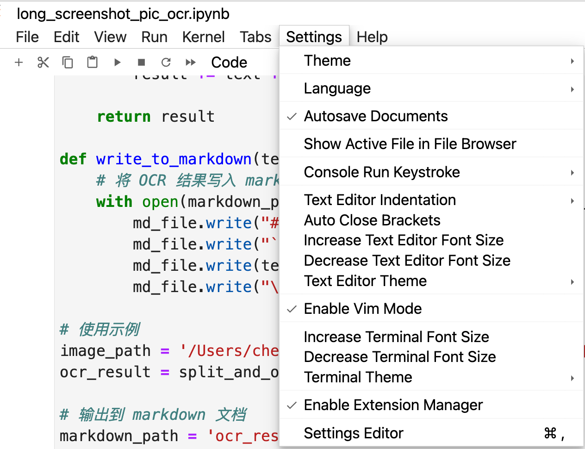

## 一、各软件中使用类似 VIM 的体验

**Jupyterlab Desktop** 

内置了 Enable VIM mode，见`Settings- Enable Vim Mode`




### 在微软 Word 中用 VIM:

我自己写了插件，可以参考我的文章：https://jackcheng.chat/2024/11/03/vim-word-experience/


### Chrome 中使用 VIM

https://vimium.github.io/ 用这个插件。


### 在 Vnote 中使用 VIM的部分功能：

https://gitee.com/jiangsheng1987/VNote/blob/master/src/resources/docs/shortcuts_zh.md

vNote**快捷键说明**

1. 以下按键除特别说明外，都不区分大小写；
2. 在macOS下，`Ctrl`对应于`Command`,在Vim模式下除外。

#### 常规快捷键

- `Ctrl+E E`
  是否扩展编辑区域。
- `Ctrl+Alt+N`
  在当前文件夹下新建笔记。
- `Ctrl+F`
  页内查找和替换。
- `Ctrl+Alt+F`
  高级查找。
- `Ctrl+Q`
  退出VNote。
- `Ctrl+J`/`Ctrl+K`
  在笔记本列表、文件夹列表、笔记列表、已打开笔记列表和大纲目录中，均支持`Ctrl+J`和`Ctrl+K`导航。
- `Ctrl+Left Mouse`
  任意滚动。
- `Ctrl+Shift+T`
  恢复上一个关闭的文件。
- `Ctrl+Alt+L`
  打开灵犀页。
- `Ctrl+T`
  编辑当前笔记或保存更改并退出编辑模式。
- `Ctrl+G`
  激活通用入口。

#### 阅读模式

- `H`/`J`/`K`/`L`
  导航，对应于左/下/上/右方向键。

- `Ctrl+U`
  向上滚动半屏。

- `Ctrl+D`
  向下滚动半屏。

- `gg`/`G`
  跳转到笔记的开始或结尾。（区分大小写）。

- `Ctrl + +/-`
  放大/缩小页面。

- `Ctrl+Wheel`
  鼠标滚轮实现放大/缩小页面。

- `Ctrl+0`
  恢复页面大小为100%。

- 标题跳转

  - `<N>[[`：跳转到上`N`个标题；
  - `<N>]]`: 跳转到下`N`个标题；
  - `<N>[]`：跳转到上`N`个同层级的标题；
  - `<N>][`：跳转到下`N`个同层级的标题；
  - `<N>[{`：跳转到上`N`个高一层级的标题；
  - `<N>]}`：跳转到下`N`个高一层级的标题；

- ```
  /
  ```

  或

  ```
  ?
  ```

  向前或向后查找

  - `N`：查找下一个匹配；
  - `Shift+N`：查找上一个匹配；

- ```
  :
  ```

  执行Vim命令

  - `:q`：关闭当前笔记；
  - `:noh[lsearch]`：清空查找高亮；

#### 编辑模式

- `Ctrl+S`
  保存当前更改。
- `Ctrl + +/-`
  放大/缩小页面。
- `Ctrl+Wheel`
  鼠标滚轮实现放大/缩小页面。
- `Ctrl+0`
  恢复页面大小为100%。
- `Ctrl+J/K`
  向下/向上滚动页面，不会改变光标。

##### 文本编辑

- `Ctrl+B`
  插入粗体；再次按`Ctrl+B`退出。如果已经选择文本，则将当前选择文本加粗。
- `Ctrl+I`
  插入斜体；再次按`Ctrl+I`退出。如果已经选择文本，则将当前选择文本改为斜体。
- `Ctrl+D`
  插入删除线；再次按`Ctrl+D`退出。如果已经选择文本，则将当前选择文本改为删除线。
- `Ctrl+;`
  插入行内代码；再次按`Ctrl+;`退出。如果已经选择文本，则将当前选择文本改为行内代码。
- `Ctrl+M`
  插入代码块；再次按`Ctrl+M`退出。如果已经选择文本，则将当前选择文本嵌入到代码块中。
- `Ctrl+L`
  插入链接。
- `Ctrl+'`
  插入图片。
- `Ctrl+H`
  退格键，向前删除一个字符。
- `Ctrl+W`
  删除光标位置向后到第一个空白字符之间的所有字符。
- `Ctrl+U`
  删除光标位置到行首的所有字符。
- `Ctrl+<Num>`
  插入级别为`<Num>`的标题。`<Num>`应该是1到6的一个数字。如果已经选择文本，则将当前选择文本改为标题。
- `Ctrl+7`
  删除当前行或所选择文本的标题标记。
- `Tab`/`Shift+Tab`
  增加或减小缩进。如果已经选择文本，则对所有选择的行进行缩进操作。
- `Shift+Enter`
  插入两个空格然后换行，在Markdown中类似于软换行的概念。
- `Shift+Left`, `Shift+Right`, `Shift+Up`, `Shift+Down`
  扩展选定左右一个字符，或上下一行。
- `Ctrl+Shift+Left`, `Ctrl+Shift+Right`
  扩展选定到单词开始或结尾。
- `Ctrl+Shift+Up`, `Ctrl+Sfhit+Down`
  扩展选定到段尾或段首。
- `Shift+Home`, `Shift+End`
  扩展选定到行首和行尾。
- `Ctrl+Shift+Home`, `Ctrl+Shift+End`
  扩展选定到笔记开始或结尾处。


## 二、Vim Keyboard Shortcuts

**改键盘映射**

通过在 KE中导入设置，将 CapsLock 映射为 Ctrl 和 Esc，点按为 Esc，按住为 Ctrl。

打开 terminal，输入`vimtutor`继续学习，目前刚好完成了 1.3


### 1、Navigating the page

1. **j**Scroll down
2. **k**Scroll up
3. **gg**Scroll to the top of the page
4. **G**Scroll to the bottom of the page
5. **d**Scroll a half page down
6. **u**Scroll a half page up
7. **h**Scroll left
8. **l**Scroll right
9. **r**Reload the page
10. **yy**Copy the current URL to the clipboard
11. **p**Open the clipboard's URL in the current tab
12. **P**Open the clipboard's URL in a new tab
13. **i**Enter insert mode
14. **v**Enter visual mode
15. **gi**Focus the first text input on the page
16. **f**Open a link in the current tab
17. **F**Open a link in a new tab
18. **gf**Select the next frame on the page
19. **gF**Select the page's main/top frame

### 2、Text Editing


#### insertion:

应该在 normal mode 下面进行移动（通过 hjkl），移动到需要修改的地方，然后随时按下 `i`进行文档编辑。

#### appending:

在 normal mode 下面，移动光标，然后按下 a 键，在行的末尾进入添加字符模式。如果是 i 键就是开头。

a: insert after the cursor

A: append at the end of the line

i: append before cursor

I: insert at the beginning of line

#### undo 撤销修改

先回到 normal mode, 再点击
`u` : 撤销上一步修改
Control +R : 恢复上一步修改
`U`: 大写的 u，撤销对整行的修改

> 在撤销的时候，结合 motion（w e 0 $）可以移动得更快。


#### 保存对应的文件修改，并退出

`:wq` 保存修改文件并退出

`:q!`不保存修改，直接退出

### 3、Command 修改

注意，以下修改，必须先进入到 normal mode

####  这里 motion本身就是一个动作，可以在前面加一个数字，表示移动指定单位
w: move the cursor one word forward每一次移动一个单词，并且结束后光标都位于下一个单词的开头, `nw` move n times
e: move the cursor to the end of the first word forward.并且光标每次都位于下一个单词都末尾
$: move the cursor to the end of the line.
0: move the curson to the start of the line, caret ^ 也可以起到同样的功能。

这里能感受到Bash 本身也是 a programming language：
> operator [number] motion
就是一个内置的function

#### deleting commands

`x`：在 normal mode 下按下 x 键，可以删除当前光标闪烁下的一个字符。

但是删除不止一个 character 的话，语法会不一样。

> operator [number] motion
> where 
> operator is what to do, such as `d` for delete, `c` for change
> [number] an optional count

下面的删除动作，没有带数字，默认是 1。
`dw`或者 `de`：删除一个 word，有些微不同

`dd`：删除一行

`d$`：从当前光标删除到本行末尾


> 同时删除好几个 words 或者 lines 

譬如：
`d2w`: 删除两个全大写的 words（two UPPER CASE words）
`2dd`或者 `d2d`: 删除两行

#### dd + P：剪切当前行再粘贴
当要把某几行 line 调换位置的时候
先把当前一行（dd）或者多行文字剪切（d+ n + d），然后移动到要放置的位的上一行，再点击 `P`（其实是 paste），就把之前貌似删除的行数移动到了新位置。

#### replace command
先要以 normal mode，移动到对应的字符下方。记住之前 x 是删除当前光标下字符。而
> r + 要修改的字符，可以非常方便的直接替换一个字符。

#### 多个字符的修改 ce 或者 cc
> 仍然遵循 上面 `operator [number] motion`的语法
> 这里 operator 是 c (change), motion 和上面类似：
> w: to the beginning of the next word
> e: to the end of the next word，如果光标在单词中间，其实 cw 和 ce 差别不大。
> $: to the end of the line
上面的 r + 字符 方法适合个别单词拼写错误的修改，但是无法替换多个字符，如果是多个字符，下面的命令效率更高。
`ce`：删除当前 word，并进入 insert mode
`cc`：删除当前 Line，并进入 insert mode。

### 4、location and file status


### 3、Using find

1. **/**Enter find mode
2. **n**Cycle forward to the next find match
3. **N**Cycle backward to the previous find match

### 4、Using the vomnibar

1. **o**Open URL, bookmark or history entry
2. **O**Open URL, bookmark or history entry in a new tab
3. **b**Open a bookmark
4. **B**Open a bookmark in a new tab
5. **T**Search through your open tabs

### Navigating history

1. **H**Go back in history
2. **L**Go forward in history

### Manipulating tabs

1. **t**Create new tab
2. **J**Go one tab left
3. **K**Go one tab right
4. **g0**Go to the first tab
5. **g$**Go to the last tab
6. **yt**Duplicate current tab
7. **x**Close current tab
8. **X**Restore closed tab

### Miscellaneous

1. **?**Show help


---


### 三、Introduction to Practical Vim Usage for Beginners

Vim is a powerful text editor that can seem daunting at first, but learning it offers tremendous benefits for efficient and effective text editing. It's highly customizable, supports advanced editing capabilities, and is available on almost every Unix-based system, making it ideal for developers and power users alike. This guide introduces practical Vim commands that will get novice users comfortable with editing text, navigating files, and making the most of Vim's unique features.

#### Why Learn Vim?
- **Speed and Efficiency**: Vim allows you to perform complex editing with a few keystrokes.
- **Availability**: Vim is available on most Unix systems by default, including MacOS and Linux servers.
- **Customizability**: Vim is highly configurable with plugins and scripts that can tailor the experience to your workflow.

#### Understanding Vim Modes
Vim has several modes, each suited for different tasks. The primary modes are:
1. **Normal Mode**: The default mode for navigation and basic commands.
2. **Insert Mode**: Used for typing and editing text.
3. **Visual Mode**: For selecting text.
4. **Command Mode**: For executing extended commands.

Here’s how to enter each mode:
- **Normal Mode**: Press `Esc`.
- **Insert Mode**: Press `i` (or `a` to insert after the cursor).
- **Visual Mode**: Press `v`.
- **Command Mode**: Press `:` in Normal Mode.

### Basic Commands for Navigation
1. **Moving Around**:
   - **h, j, k, l**: Move left, down, up, and right respectively (replacing arrow keys).
   
     > 按 `4 + j `会往下移动 4 行
   
   - **w**: Move to the beginning of the next word.

   - **b**: Move to the beginning of the previous word.
   
   - **0**: Move to the beginning of the line.
   
   - **$**: Move to the end of the line. 
   
2. **Scrolling**:
   - **Ctrl + u**: Scroll up.
   - **Ctrl + d**: Scroll down.
   - **G**: Jump to the end of the file.
   - **gg**: Jump to the beginning of the file.

3. **Line Number Navigation**:
   - **:number**: Jump to a specific line number (e.g., `:10` to go to line 10).

### Editing Text
1. **Entering Insert Mode**:
   - **i**: Enter Insert Mode at the cursor position.
   - **a**: Enter Insert Mode just after the cursor.
   - **o**: Open a new line below the cursor and enter Insert Mode.
   - **O**: Open a new line above the cursor and enter Insert Mode.

2. **Deleting Text**: normal mode 下操作
   - **x**: Delete the character under the cursor.
   - **dd**: Delete the entire line.
   - **dw**: Delete a word.
   - **d$**: Delete from the cursor to the end of the line.

3. **Copying and Pasting**: normal mode 下操作
   - **yy**: Copy (yank) the entire line.
   - **y$**: Yank from the cursor to the end of the line.
   - **p**: Paste the yanked or deleted text after the cursor.
   - **P**: Paste before the cursor.

4. **Undo and Redo**: 撤销
   - **u**: Undo the last change.
   - **Ctrl + r**: Redo the last undone change.

### Searching and Replacing Text
1. **Searching**:  normal mode 下操作
   - **/text**: Search for "text" forward.
   - **?text**: Search for "text" backward.
   - **n**: Move to the next occurrence.
   - **N**: Move to the previous occurrence.

2. **Replacing**:
   - **:s/old/new**: Replace the first occurrence of "old" with "new" on the current line.
   - **:s/old/new/g**: Replace all occurrences of "old" with "new" on the current line.
   - **:%s/old/new/g**: Replace all occurrences of "old" with "new" in the entire file.

### Saving and Exiting
1. **Saving**:
   - **:w**: Save the file.
   - **:w filename**: Save the file with a new filename.

2. **Exiting**:
   - **:q**: Quit if no changes have been made.
   - **:q!**: Quit without saving changes.
   - **:wq** or **ZZ**: Save and quit.

### Customizing Your Vim Experience
Vim supports a configuration file (`.vimrc`) for setting custom behaviors and adding plugins. For example, adding `set number` to `.vimrc` will display line numbers, making navigation easier.

### Practice Tips for Beginners
- **Start Small**: Begin by using Vim for simple text files.
- **Learn Shortcuts Gradually**: Focus on a few commands at a time to avoid overwhelming yourself.
- **Practice Regularly**: Use Vim whenever possible to build muscle memory and efficiency.

### Conclusion
With a bit of practice, Vim's commands become second nature, allowing you to edit text efficiently and with minimal reliance on the mouse. Vim’s unique approach to text editing may take time to master, but its benefits in terms of speed, availability, and extensibility make it a powerful tool worth learning for any programmer or tech enthusiast.


## 四、设置 vimrc


Creating a `.vimrc` configuration file can greatly enhance your Vim experience, especially as a beginner. This file allows you to set custom behaviors and preferences, which can make Vim more intuitive and user-friendly.

Here's a recommended `.vimrc` setup for beginners:

```vim
" Basic settings for beginner-friendly Vim usage

" Show line numbers
set number

" Enable syntax highlighting
syntax on

" Highlight current line for better focus
set cursorline

" Set tabs and indentation for consistency
set tabstop=4       " Number of spaces per tab
set shiftwidth=4    " Number of spaces for auto-indents
set expandtab       " Use spaces instead of tabs

" Enable incremental search (search as you type)
set incsearch

" Ignore case in searches (case insensitive)
set ignorecase

" Override ignorecase if search includes uppercase letters (smart case)
set smartcase

" Show matching parentheses and brackets
set showmatch

" Enable mouse support (helpful for beginners)
set mouse=a

" Visual feedback for line wrap
set wrap            " Wrap long lines
set linebreak       " Break lines at word boundaries

" Better backspace behavior
set backspace=indent,eol,start

" Enable clipboard for system copy-paste (works on most OS)
set clipboard=unnamedplus

" Allow persistent undo, even after closing files
set undofile

" Enable autocompletion menu
set wildmenu
set wildmode=list:longest

" Improve command-line completion with wildcards
set wildignore=*.o,*.obj,*.bak,*.exe,*.pyc,*.pyo,*.class

" Display unsaved changes with a symbol in the gutter
set signcolumn=yes

" Show command in the bottom bar as you type
set showcmd

" Set timeout for mapped sequences (useful for custom key mappings)
set timeoutlen=500

" Customize the appearance of the status line
set laststatus=2
set ruler

" Disable error sounds
set noerrorbells
set visualbell
set t_vb=

" Start in Normal mode when opening Vim
autocmd BufEnter * startinsert

" Key mappings for improved efficiency

" Map `jj` to Escape in Insert mode for easier mode switching
inoremap jj <Esc>

" Quick saving with `<Leader>w` (default leader key is `\`)
nnoremap <Leader>w :w<CR>

" Quick quitting with `<Leader>q`
nnoremap <Leader>q :q<CR>

" Easy navigation between splits with Ctrl + arrow keys
nnoremap <C-Left> <C-w>h
nnoremap <C-Down> <C-w>j
nnoremap <C-Up> <C-w>k
nnoremap <C-Right> <C-w>l
```

### Explanation of Key `.vimrc` Settings

- **Line Numbers and Syntax Highlighting**: These make it easier to read code and navigate.
- **Tabs and Indentation**: Setting `tabstop`, `shiftwidth`, and `expandtab` helps maintain consistent formatting.
- **Search Customizations**: `incsearch`, `ignorecase`, and `smartcase` make searches faster and more intuitive.
- **Clipboard Integration**: Allows Vim to use the system clipboard for copying and pasting.
- **Undo History**: `undofile` keeps undo history even after closing a file.
- **Key Mappings**: Mappings like `jj` for Escape in Insert mode make mode switching easier, while `<Leader>w` for saving and `<Leader>q` for quitting offer quick access to common commands.
- **Split Navigation**: The `Ctrl` + arrow mappings make moving between split windows intuitive.

This configuration will make Vim more approachable, helping you focus on editing and learning Vim’s basics without struggling with initial setup. You can add more advanced settings as you get comfortable with Vim.


## 五、how to use Vim like Pro

Using Vim like a pro involves mastering navigation, editing, and customization to make the most out of this powerful text editor. Here’s a comprehensive guide to get you working efficiently in Vim and moving beyond the basics.

### 1. Master Advanced Navigation

Efficient navigation is at the core of Vim. Here are some pro-level navigation techniques:

- **Moving by Word**: 
  - `w`: Move forward to the start of the next word.
  - `b`: Move backward to the start of the previous word.
  - `e`: Move to the end of the current word.

- **Moving by Sentence and Paragraph**:
  - `(`: Jump to the beginning of the sentence.
  - `)`: Jump to the end of the sentence.
  - `{`: Jump to the start of the paragraph.
  - `}`: Jump to the end of the paragraph.

- **Line Navigation**:
  - `0`: Move to the beginning of the line.
  - `$`: Move to the end of the line.
  - `^`: Move to the first non-blank character of the line.9g9G

- **File Navigation**:
  - `gg`: Go to the beginning of the file.
  - `G`: Go to the end of the file.
  - `<number>G`: Go to a specific line number (e.g., `10G` to go to line 10).

### 2. Utilize Visual Mode for Efficient Text Selection

- **Visual Mode Types**:
  - `v`: Enter character-wise Visual Mode.
  - `V`: Enter line-wise Visual Mode.
  - `Ctrl + v`: Enter block Visual Mode, which is especially useful for selecting columns or editing vertical blocks of text.

- **Manipulate Text in Visual Mode**:
  - Select text and then press `y` to copy or `d` to cut the selection.
  - Press `p` to paste after the current cursor position or `P` to paste before.

### 3. Take Advantage of Registers

Vim stores copied or deleted text in **registers**. Using these registers can streamline repetitive text handling:

- `"0p`: Paste the last yanked (copied) text.
- `"1p`: Paste the last deleted text.
- `"+p`: Access the system clipboard (for copying to/from outside Vim).

### 4. Use Macros for Repetitive Tasks

Macros allow you to record a sequence of commands and replay them. This is incredibly useful for repetitive tasks:

1. Start recording with `q` followed by any letter (e.g., `qa` to record into register `a`).
2. Perform your actions.
3. Stop recording by pressing `q` again.
4. Replay the macro with `@a`. You can repeat it multiple times by typing a number before the command (e.g., `5@a` to run the macro 5 times).

### 5. Search and Replace with Power

- **Basic Search**: `/pattern` to search forward and `?pattern` to search backward.
- **Search and Replace Globally**:
  - `:%s/old/new/g`: Replace all occurrences of `old` with `new` in the file.
  - `:%s/old/new/gc`: Replace with confirmation (Vim will ask you to confirm each change).
- **Use Ranges**: `:1,10s/old/new/g` will replace text only between lines 1 and 10.

### 6. Master Buffers and Windows

- **Buffers**: Vim can keep multiple files open simultaneously as buffers.
  - `:e filename`: Open a file in a new buffer.
  - `:bn` and `:bp`: Move to the next and previous buffers.
  - `:bd`: Close a buffer.

- **Splits**: View multiple buffers side by side.
  - `:vsplit filename`: Open a file in a vertical split.
  - `:split filename`: Open a file in a horizontal split.
  - Use `Ctrl + w` followed by `h`, `j`, `k`, or `l` to navigate between splits.
  
### 7. Customize with Plugins and .vimrc

To unlock even more power, use plugins and customize your `.vimrc` file:

- **Plugins**:
  - Use a plugin manager like [vim-plug](https://github.com/junegunn/vim-plug) to easily install plugins.
  - Some popular plugins for pros:
    - **nerdtree**: A file tree explorer.
    - **fzf.vim**: Fuzzy file finder.
    - **vim-airline**: Enhanced status bar.
    - **surround.vim**: Easier manipulation of surrounding characters like parentheses or quotes.
  
- **Sample .vimrc Settings for Pros**:
  ```vim
  set number                  " Show line numbers
  set relativenumber          " Show relative line numbers for easy navigation
  set clipboard=unnamedplus   " Use system clipboard
  set tabstop=4               " Set tab width
  set shiftwidth=4            " Indent width
  set expandtab               " Use spaces instead of tabs
  set autoindent              " Auto-indent new lines
  set cursorline              " Highlight the cursor line
  syntax on                   " Enable syntax highlighting
  ```

### 8. Speed Up Your Workflow with Useful Mappings

Mappings can drastically reduce keystrokes:

- **Easy Save and Quit**:
  
  - nnoremap <Leader>w :w<CR> allows you to save the current file by pressing <Leader>w.
  - nnoremap <Leader>q :q<CR> allows you to quit Vim by pressing <Leader>q.
    These mappings provide quick shortcuts for saving and quitting files in Vim. You can press, for example, \w to save or \q to quit (if \ is the Leader key).

  ```vim
  nnoremap <Leader>w :w<CR>
  nnoremap <Leader>q :q<CR>
  ```
  
- **Quick Window Navigation**:
  
  ```vim
  nnoremap <C-h> <C-w>h
  nnoremap <C-j> <C-w>j
  nnoremap <C-k> <C-w>k
  nnoremap <C-l> <C-w>l
  ```

### 9. Use Folding for Complex Files

Folding lets you collapse sections of code:

- `za`: Toggle fold (open/close).
- `zR`: Open all folds.
- `zM`: Close all folds.
- Customize folding behavior with `set foldmethod=syntax` for code or `set foldmethod=indent` for plain text files.

### 10. Embrace Ex Commands

Ex commands give you fine-grained control over files and text:

- **Write and Quit All**: `:wa` (write all open buffers), `:xa` (save and quit all).
- **Filter Text**:
  - `:1,10!sort` sorts lines 1-10.
  - `:.,+5!grep pattern` filters lines from the current line to five lines below for a pattern.

### Final Tips for Mastering Vim

- **Practice Regularly**: Consistency is key to building muscle memory.
- **Learn One New Command at a Time**: Slowly build your command repertoire to avoid feeling overwhelmed.
- **Explore Vim’s Help**: Access Vim’s detailed help system with `:help command` (e.g., `:help search`).
- **Challenge Yourself with Vim Adventures**: This game-like tutorial (https://vim-adventures.com/) helps make learning fun.

Mastering Vim takes time, but by focusing on these areas, you’ll soon find yourself editing like a pro!